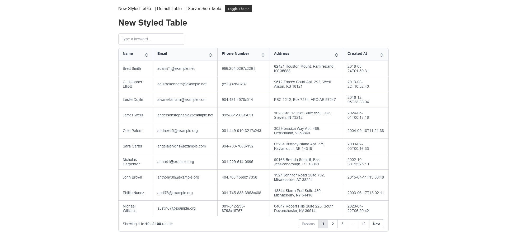
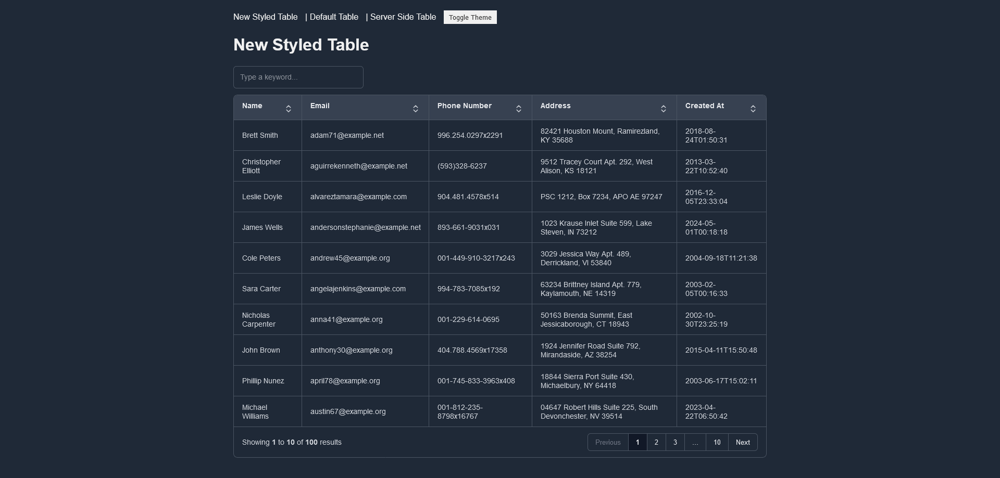

# Flask-Gridjs Example
1. I changed the theme of Grid.js for Flask. 
2. I added Light and Dark mode. 
3. I added a server side example for Flask

## Usage

Copy the `static/css` folder from the repository into your project in the same way. Then, copy and paste the `icons` folder as well. Finally, add the following code to your `base.html`. That's all you need to do.

`<link rel="stylesheet" href="{{ url_for('static', filename='css/table.css') }}">`

### Light Mode

### Dark Mode

