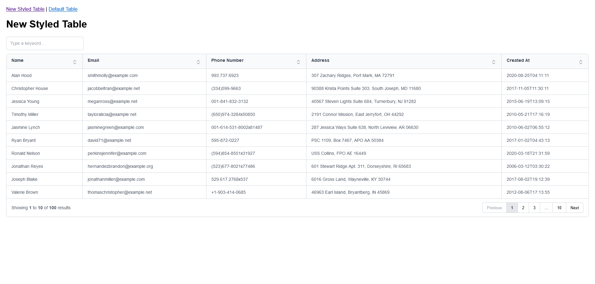

# Flask-Gridjs Redesign
I have redesigned the theme for Grid.js used for Data Tables and changed the icons.

## Usage

Copy the `static/css` folder from the repository into your project in the same way. Then, copy and paste the `icons` folder as well. Finally, add the following code to your `base.html`. That's all you need to do.

`<link rel="stylesheet" href="{{ url_for('static', filename='css/table.css') }}">`

Screenshot  

